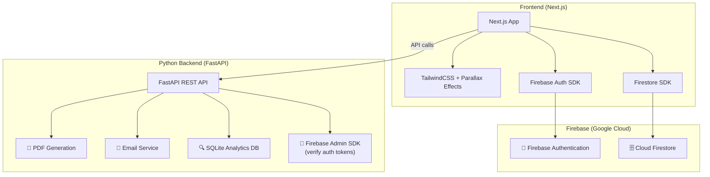

# Wave of Bengal — Finalized Tech Stack

## Architecture Overview



---

## Layer-by-Layer Breakdown

### 🖥️ Frontend
| Component | Technology | Purpose |
|---|---|---|
| Framework | **Next.js 14+** (App Router) | SSR/SSG for SEO, file-based routing |
| Language | **JavaScript** (JSX) | Component logic |
| Styling | **TailwindCSS** (npm, not CDN) | Utility-first CSS |
| Animations | **Framer Motion** | Parallax scrolling, page transitions, micro-animations |
| Auth Client | **Firebase JS SDK** | Login/signup/session management |
| Database Client | **Firebase JS SDK** | Read/write Firestore directly from frontend |
| HTTP Client | **fetch / axios** | Calls to FastAPI backend |

### 🔐 Authentication
| Component | Technology | Purpose |
|---|---|---|
| Provider | **Firebase Authentication** | Free up to 50K monthly active users |
| Methods | Email/Password + Google Sign-In | User registration and login |
| Admin Roles | **Firestore `users` collection** | `role: "admin"` field for admin access |
| Backend Auth | **Firebase Admin SDK (Python)** | Verify tokens on FastAPI endpoints |

### 🗄️ Database (Firestore)
| Collection | Key | Data Stored |
|---|---|---|
| `users` | Firebase Auth UID | name, email, phone, role, addresses, createdAt |
| `products` | slug (e.g. `black-tiger-prawns`) | name, price, weight, description, image, category, stock |
| `orders` | order ID (e.g. `WOB-20260221-001`) | userId, items, total, status, shippingAddress, createdAt |

> [!NOTE]
> Firestore free tier: 50K reads + 20K writes/day. Reserved ONLY for core business data.

### ⚡ Backend API (FastAPI)
| Component | Technology | Purpose |
|---|---|---|
| Framework | **FastAPI** (Python) | REST API with auto-generated Swagger docs |
| PDF Generation | **reportlab** or **fpdf2** | Order receipt PDFs |
| Email | **smtplib** + Gmail | Sending receipts to customers |
| Analytics DB | **SQLite** (built into Python) | Search query tracking — free, unlimited |
| Auth Verification | **firebase-admin** (Python) | Verify user tokens from frontend |
| Server | **Uvicorn** | ASGI server to run FastAPI |

### 📊 Analytics (Cost: ₹0)
| What | Where | Why Here |
|---|---|---|
| General traffic, clicks, conversions | **Firebase Analytics** | Free, automatic, Google dashboards |
| Search queries, filters, product views | **SQLite on FastAPI** | Free, unlimited writes, no Firestore cost |

---

## Hosting Plan
| Component | Hosted On | Cost |
|---|---|---|
| Next.js frontend | **Vercel** | Free tier |
| FastAPI backend | **Heroku** (Eco dyno) | $5/month (~₹420) |
| Firebase (Auth + Firestore) | **Google Cloud** | Free (Spark plan) |
| SQLite | Lives on Heroku (FastAPI server) | Free |

---

## Key Dependencies

### Frontend (`package.json`)
```
next, react, react-dom
tailwindcss, postcss, autoprefixer
framer-motion
firebase
axios
```

### Backend (`requirements.txt`)
```
fastapi
uvicorn
firebase-admin
fpdf2
python-dotenv
aiosmtplib (or smtplib)
```

---

## Cost Summary

| Service | Free Tier Limit | Cost |
|---|---|---|
| Firebase Auth | 50K users/month | ₹0 |
| Firestore | 50K reads + 20K writes/day | ₹0 (analytics offloaded to SQLite) |
| Firebase Analytics | Unlimited | ₹0 |
| Vercel | 100GB bandwidth/month | ₹0 |
| Heroku (Eco dyno) | Always-on backend | ~₹420/month ($5) |

**Total monthly cost: ~₹420/month** (just the Heroku dyno)
