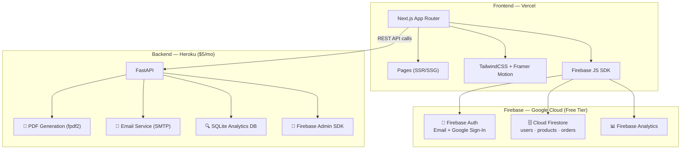
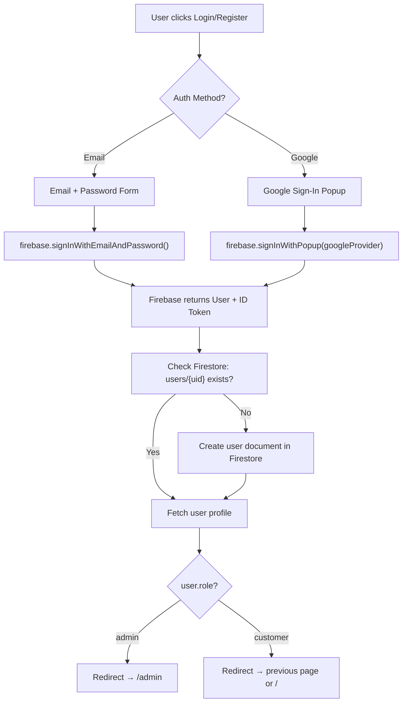
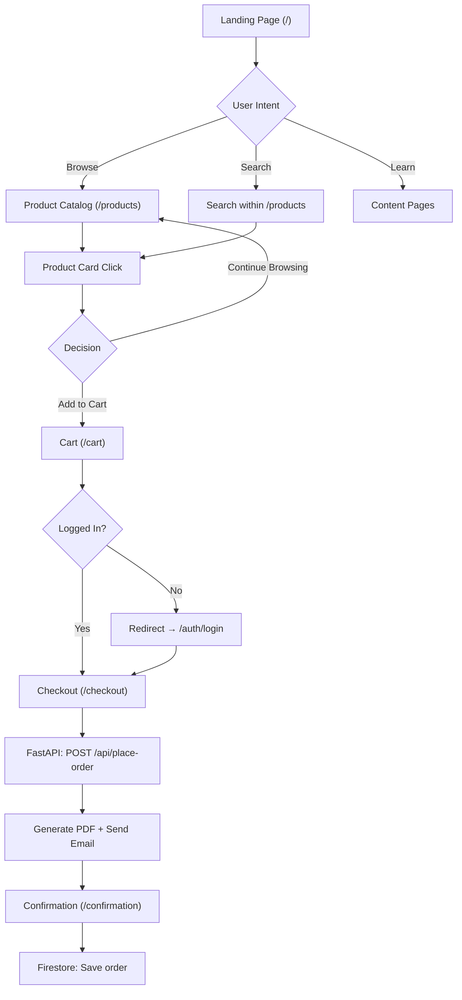
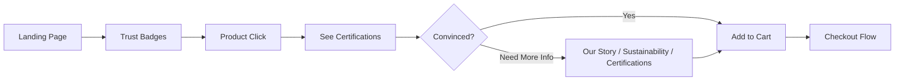
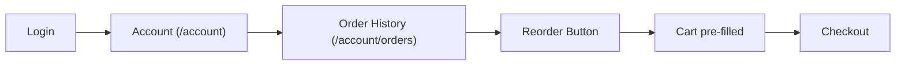

# Wave of Bengal — Complete Product & User Flow Documentation
### Premium Seafood E-commerce Platform

> **Stack**: Next.js 14+ · TailwindCSS · Framer Motion · Firebase Auth · Cloud Firestore · FastAPI (Python) · SQLite · Heroku
>
> **Last Updated**: February 2026

---

## 📋 Table of Contents
1. [System Architecture](#system-architecture)
2. [Entry Points & Routing](#entry-points--routing)
3. [Authentication Flow](#authentication-flow)
4. [Main User Journeys](#main-user-journeys)
5. [Detailed Page Flows](#detailed-page-flows)
6. [Error Handling & Edge Cases](#error-handling--edge-cases)
7. [Retention & Growth Strategies](#retention--growth-strategies)
8. [Technical Implementation](#technical-implementation)
9. [Mobile Considerations](#mobile-considerations)
10. [Security & Privacy](#security--privacy)
11. [Success Metrics](#success-metrics)
12. [Conversion Optimization Checklist](#conversion-optimization-checklist)

---

## 🏗️ System Architecture



### Data Ownership Map

| Data | Stored In | Why |
|---|---|---|
| User accounts & profiles | **Firebase Auth + Firestore** | Auth handles login, Firestore stores extended profile |
| Product catalog | **Firestore** `products` collection | Real-time updates, admin CRUD |
| Orders | **Firestore** `orders` collection | Linked to user UID, persistent |
| Cart | **React Context + Firestore sync** | Local state for speed, Firestore for persistence across devices |
| Search analytics | **SQLite on Heroku** | High-volume, free, unlimited writes |
| PDF receipts | **Generated on Heroku** | Server-side only (fpdf2) |
| Email delivery | **Heroku SMTP** | Server-side only (Gmail) |

---

## 🚪 Entry Points & Routing

### Next.js App Router Structure

```
app/
├── page.jsx                    ← Landing page (/)
├── layout.jsx                  ← Root layout (nav + footer)
├── products/
│   └── page.jsx                ← Product catalog (/products)
├── cart/
│   └── page.jsx                ← Shopping cart (/cart)
├── checkout/
│   └── page.jsx                ← Checkout form (/checkout)
├── confirmation/
│   └── page.jsx                ← Order confirmed (/confirmation)
├── our-story/
│   └── page.jsx                ← Brand heritage (/our-story)
├── sustainability/
│   └── page.jsx                ← Eco practices (/sustainability)
├── certifications/
│   └── page.jsx                ← Quality certs (/certifications)
├── auth/
│   ├── login/
│   │   └── page.jsx            ← Login (/auth/login)
│   └── register/
│       └── page.jsx            ← Register (/auth/register)
├── account/
│   ├── page.jsx                ← User profile (/account)
│   └── orders/
│       └── page.jsx            ← Order history (/account/orders)
└── admin/
    ├── page.jsx                ← Admin dashboard (/admin)
    └── products/
        └── page.jsx            ← Product management (/admin/products)
```

### Route Access Control

| Route | Auth Required | Role | Rendering |
|---|---|---|---|
| `/` | No | Any | SSG (static) |
| `/products` | No | Any | SSG + ISR (revalidate) |
| `/cart` | No | Any | Client-side |
| `/checkout` | **Yes** | Customer | Client-side |
| `/confirmation` | **Yes** | Customer | Client-side |
| `/our-story`, `/sustainability`, `/certifications` | No | Any | SSG (static) |
| `/auth/login`, `/auth/register` | No | Guest only | Client-side |
| `/account`, `/account/orders` | **Yes** | Customer | Client-side |
| `/admin`, `/admin/products` | **Yes** | **Admin only** | Client-side |

### Entry Point Scenarios

```
USER ARRIVES
    │
    ├── First-Time Visitor (no auth)
    │   └── Landing Page → Video Intro → Browse Products
    │
    ├── Returning Visitor (auth cookie exists)
    │   └── Landing Page (skip intro) → "Welcome back, {name}"
    │
    ├── External Traffic
    │   ├── Google/Ads → /products (direct to catalog)
    │   ├── Social Media → / (landing page)
    │   └── Email Link → /products or /account/orders
    │
    └── Admin
        └── /auth/login → /admin (dashboard)
```

---

## 🔐 Authentication Flow

### Firebase Auth Integration



### Firestore User Document

```javascript
// Firestore: users/{firebase_auth_uid}
{
  name: "Priya Sharma",
  email: "priya@example.com",         // synced from Firebase Auth
  phone: "+91 98765 43210",
  role: "customer",                    // "customer" | "admin"
  addresses: [
    {
      id: "addr_1",
      label: "Home",
      address: "123 Marine Drive",
      city: "Mumbai",
      state: "Maharashtra",
      pincode: "400020",
      isDefault: true
    }
  ],
  preferences: {
    emailNotifications: true,
    smsNotifications: true
  },
  loyaltyPoints: 450,
  tier: "SILVER",                      // "SILVER" | "GOLD" | "PLATINUM"
  createdAt: Timestamp,
  lastLogin: Timestamp
}
```

### Admin Role Assignment

Admin roles are set via a `role` field in the Firestore `users` document. Only existing admins can promote other users. The frontend checks this field before rendering admin routes; the FastAPI backend verifies the Firebase token AND checks the Firestore role before processing admin API requests.

---

## 🛤️ Main User Journeys

### Journey 1: Browse & Purchase (Primary Conversion Path)



### Journey 2: First-Time Buyer Education Path



### Journey 3: Returning Customer Quick Reorder



---

## 📊 Detailed Page Flows

### 1. Landing Page (`/`)

```
┌──────────────────────────────────────────────────────────────────────┐
│                         LANDING PAGE                                  │
├──────────────────────────────────────────────────────────────────────┤
│                                                                       │
│  ┌──────────────────────────────────────────────────────────────┐   │
│  │  HERO SECTION (Full viewport + Parallax)                      │   │
│  │  • Background: Ocean video or high-res image                  │   │
│  │  • H1: "Fresh From Ocean to Your Doorstep"                    │   │
│  │  • Subtitle: Premium seafood, sustainably sourced             │   │
│  │  • CTA Button: "Explore Fresh Catch" → /products              │   │
│  │  • Framer Motion: Fade-in + parallax scroll on text           │   │
│  └──────────────────────────────────────────────────────────────┘   │
│                          ↓ scroll (parallax)                          │
│  ┌──────────────────────────────────────────────────────────────┐   │
│  │  TRUST BADGES ROW (Framer Motion stagger animation)           │   │
│  │  [ 100% Fresh ] [ Same Day Delivery ] [ Certified ] [ Eco ]  │   │
│  └──────────────────────────────────────────────────────────────┘   │
│                          ↓ scroll (parallax)                          │
│  ┌──────────────────────────────────────────────────────────────┐   │
│  │  FEATURED PRODUCTS (3 cards from Firestore)                    │   │
│  │  • Fetched via: Firestore query (featured: true, limit: 3)   │   │
│  │  • Each card: Image, name, price, "Add to Cart"              │   │
│  │  • "View All" → /products                                     │   │
│  └──────────────────────────────────────────────────────────────┘   │
│                          ↓ scroll (parallax)                          │
│  ┌──────────────────────────────────────────────────────────────┐   │
│  │  OUR STORY TEASER                                              │   │
│  │  • 2-3 sentences about heritage                                │   │
│  │  • CTA: "Read Our Journey" → /our-story                       │   │
│  └──────────────────────────────────────────────────────────────┘   │
│                          ↓ scroll (parallax)                          │
│  ┌──────────────────────────────────────────────────────────────┐   │
│  │  TESTIMONIALS (3 customer cards, Framer Motion slide-in)      │   │
│  │  • Name, location, rating (stars), review text                │   │
│  └──────────────────────────────────────────────────────────────┘   │
│                          ↓ scroll                                     │
│  ┌──────────────────────────────────────────────────────────────┐   │
│  │  SUSTAINABILITY BANNER                                         │   │
│  │  • CTA: "Learn More" → /sustainability                        │   │
│  └──────────────────────────────────────────────────────────────┘   │
│                          ↓                                            │
│  ┌──────────────────────────────────────────────────────────────┐   │
│  │  FOOTER (Links, social, newsletter signup)                     │   │
│  └──────────────────────────────────────────────────────────────┘   │
│                                                                       │
│  Rendering: SSG (Static Site Generation) for SEO                     │
│  Data: Featured products fetched at build time + ISR revalidation    │
└──────────────────────────────────────────────────────────────────────┘
```

### 2. Product Catalog (`/products`)

```
┌──────────────────────────────────────────────────────────────────────┐
│                      PRODUCT CATALOG                                  │
├──────────────────────────────────────────────────────────────────────┤
│                                                                       │
│  HEADER: "Our Fresh Catch"                                            │
│                                                                       │
│  ┌──────────────────────────────────────────────────────────────┐   │
│  │  SEARCH BAR                                                    │   │
│  │  [🔍 Search prawns, fish, seafood...]                         │   │
│  │  → Filters Firestore query client-side                        │   │
│  │  → Sends search event to FastAPI: POST /api/track             │   │
│  └──────────────────────────────────────────────────────────────┘   │
│                                                                       │
│  ┌──────────────────────────────────────────────────────────────┐   │
│  │  FILTER BAR                                                    │   │
│  │  [All] [Tiger Prawns] [Butter Prawns] [Vannamei] [Prepared]  │   │
│  │  → Firestore query: where("category", "==", selected)        │   │
│  └──────────────────────────────────────────────────────────────┘   │
│                                                                       │
│  ┌──────────┬──────────┬──────────┐                                │
│  │ Product  │ Product  │ Product  │   3-col grid (desktop)         │
│  │ Card 1   │ Card 2   │ Card 3   │   2-col (tablet)               │
│  │          │          │          │   1-col (mobile)               │
│  │ [Image]  │ [Image]  │ [Image]  │                                │
│  │ Name     │ Name     │ Name     │                                │
│  │ ₹1,200   │ ₹850     │ ₹650     │                                │
│  │ Weight   │ Weight   │ Weight   │                                │
│  │[Add Cart]│[Add Cart]│[Add Cart]│                                │
│  └──────────┴──────────┴──────────┘                                │
│                                                                       │
│  Data Source: Firestore "products" collection                        │
│  Rendering: SSG + ISR (revalidate every 60s for stock updates)       │
│  Search Tracking: Debounced → FastAPI POST /api/track (SQLite)       │
│                                                                       │
│  ON "ADD TO CART":                                                    │
│  1. Update React Context (cart state)                                │
│  2. Toast notification: "Added to cart ✓"                            │
│  3. If logged in → sync to Firestore users/{uid}/cart                │
│  4. Track event → Firebase Analytics                                 │
└──────────────────────────────────────────────────────────────────────┘
```

### 3. Cart Page (`/cart`)

```
┌──────────────────────────────────────────────────────────────────────┐
│                           CART PAGE                                    │
├──────────────────────────────────────────────────────────────────────┤
│                                                                       │
│  H1: Shopping Cart ({n} items)                                        │
│                                                                       │
│  ┌─────────────────────────────────┬──────────────────────────────┐ │
│  │  CART ITEMS                     │  ORDER SUMMARY                │ │
│  │                                 │                              │ │
│  │  ITEM 1                         │  Subtotal:        ₹2,500    │ │
│  │  ┌─────────────────────────┐   │  Packaging Fee:      ₹50    │ │
│  │  │ [Image] Tiger Prawns    │   │  GST (5%):          ₹127    │ │
│  │  │ 1kg  ₹1,099             │   │                              │ │
│  │  │ [ - ] [2] [ + ]  🗑️    │   │  DELIVERY: Enter pincode    │ │
│  │  │ Line total: ₹2,198      │   │  ┌────────────────────┐     │ │
│  │  └─────────────────────────┘   │  │ [______] [Check]   │     │ │
│  │                                 │  └────────────────────┘     │ │
│  │  ITEM 2                         │                              │ │
│  │  ┌─────────────────────────┐   │  ○ Standard ₹99 (24hr)      │ │
│  │  │ [Image] Butter Prawns   │   │  ● Express ₹199 (12hr)      │ │
│  │  │ 500g  ₹850              │   │  ○ Premium ₹299 (6hr)       │ │
│  │  │ [ - ] [1] [ + ]  🗑️    │   │                              │ │
│  │  └─────────────────────────┘   │  ────────────────────────    │ │
│  │                                 │  TOTAL: ₹2,876               │ │
│  │                                 │                              │ │
│  │  [💚 Add ₹500 for FREE         │  [Proceed to Checkout]       │ │
│  │      delivery]                  │                              │ │
│  └─────────────────────────────────┴──────────────────────────────┘ │
│                                                                       │
│  State: React Context (CartContext)                                   │
│  Persistence: Logged in → Firestore sync | Guest → localStorage     │
│  "Proceed to Checkout" → Check auth → /auth/login or /checkout       │
└──────────────────────────────────────────────────────────────────────┘
```

### 4. Checkout (`/checkout`) — Requires Auth

```
┌──────────────────────────────────────────────────────────────────────┐
│                       CHECKOUT (Auth Required)                        │
├──────────────────────────────────────────────────────────────────────┤
│                                                                       │
│  PROGRESS: ●──────○──────○                                           │
│            Contact  Shipping  Review                                  │
│                                                                       │
│  ┌─────────────────────────────────┬──────────────────────────────┐ │
│  │  SECTION 1: CONTACT INFO        │  ORDER SUMMARY (sticky)      │ │
│  │  ─────────────────────          │  ────────────────────        │ │
│  │  Name: [auto-filled from        │  [Mini cart from Firestore]  │ │
│  │         Firestore profile]      │                              │ │
│  │  Email: [auto-filled]           │  Subtotal:    ₹2,500        │ │
│  │  Phone: [auto-filled]           │  Delivery:       ₹199       │ │
│  │                                 │  Packaging:       ₹50       │ │
│  │  SECTION 2: SHIPPING            │  GST:            ₹127       │ │
│  │  ─────────────────────          │  ─────────────────────      │ │
│  │  [Saved addresses dropdown]     │  TOTAL:        ₹2,876       │ │
│  │  ○ Home - 123 Marine Dr...     │                              │ │
│  │  ○ Office - 456 Business...    │                              │ │
│  │  ● Add new address             │                              │ │
│  │  [Full address form]            │                              │ │
│  │                                 │                              │ │
│  │  SECTION 3: REVIEW & PAY        │                              │ │
│  │  ─────────────────────          │                              │ │
│  │  Order summary + Terms          │                              │ │
│  │                                 │                              │ │
│  │  [Place Order — ₹2,876]         │                              │ │
│  └─────────────────────────────────┴──────────────────────────────┘ │
│                                                                       │
│  ON "PLACE ORDER":                                                    │
│  1. Validate all form fields (client-side)                           │
│  2. Disable button, show spinner                                     │
│  3. POST to FastAPI: /api/place-order                                │
│     → Header: Authorization: Bearer {firebase_id_token}             │
│     → Body: { customer, items, subtotal, shipping, tax, total }     │
│  4. FastAPI: Verify token → Generate PDF → Send email               │
│  5. Frontend: Save order to Firestore orders/{orderId}               │
│  6. Clear cart (Context + Firestore)                                 │
│  7. Redirect → /confirmation?orderId={id}                           │
│                                                                       │
│  FORM VALIDATION:                                                     │
│  • Name: Required, letters only                                      │
│  • Email: Valid format (from Firebase Auth, pre-filled)               │
│  • Phone: 10 digits, numeric only                                    │
│  • Address: Required, min 10 characters                              │
│  • Pincode: 6 digits                                                 │
│  • City/State: Required                                              │
└──────────────────────────────────────────────────────────────────────┘
```

### 5. Order Confirmation (`/confirmation`)

```
┌──────────────────────────────────────────────────────────────────────┐
│                     ORDER CONFIRMATION                                │
├──────────────────────────────────────────────────────────────────────┤
│                                                                       │
│                     ✓ ORDER CONFIRMED!                                │
│           Thank you for your order, {user.name}!                      │
│                                                                       │
│              Order Number: #WOB-20260221-001                          │
│                                                                       │
│  ┌────────────────────────┬───────────────────────────────────────┐ │
│  │ 🕐 Estimated Delivery  │ 📦 Items: 3                          │ │
│  │ Tomorrow, 6-10 AM      │ 💰 Total: ₹2,876                    │ │
│  └────────────────────────┴───────────────────────────────────────┘ │
│                                                                       │
│  WHAT HAPPENS NEXT?                                                   │
│  ┌────────────────────────────────────────────────────────────────┐ │
│  │ 1. ✓ Order confirmed — receipt sent to your email              │ │
│  │ 2. 🎣 Selecting the freshest catch for you                     │ │
│  │ 3. 📦 Careful insulated packaging with ice packs               │ │
│  │ 4. 🔬 Quality check before dispatch                            │ │
│  │ 5. 🏠 Delivered to your doorstep                               │ │
│  └────────────────────────────────────────────────────────────────┘ │
│                                                                       │
│  [Continue Shopping → /products]  [My Orders → /account/orders]      │
│                                                                       │
│  Data Source: Firestore orders/{orderId}                              │
│  Read via: useSearchParams() to get orderId from URL                 │
└──────────────────────────────────────────────────────────────────────┘
```

### 6. Admin Dashboard (`/admin`) — Admin Role Required

```
┌──────────────────────────────────────────────────────────────────────┐
│                      ADMIN DASHBOARD                                  │
├──────────────────────────────────────────────────────────────────────┤
│                                                                       │
│  SIDEBAR             │  MAIN CONTENT                                  │
│  ─────────           │  ────────────                                  │
│  📊 Dashboard        │  ┌────────┬────────┬────────┬────────┐       │
│  📦 Products         │  │ Total  │ Total  │ Total  │Revenue │       │
│  📋 Orders           │  │Orders  │Users   │Products│ Today  │       │
│  🔍 Analytics        │  │  142   │  89    │   12   │₹28,400 │       │
│  👤 Users            │  └────────┴────────┴────────┴────────┘       │
│  ⚙️  Settings         │                                               │
│                      │  RECENT ORDERS (from Firestore)               │
│                      │  ┌────────────────────────────────────────┐   │
│                      │  │ #WOB-001 │ Priya │ ₹2,876 │ Confirmed│   │
│                      │  │ #WOB-002 │ Ravi  │ ₹1,550 │ Shipped  │   │
│                      │  └────────────────────────────────────────┘   │
│                      │                                               │
│                      │  SEARCH ANALYTICS (from FastAPI → SQLite)     │
│                      │  Top searches: "tiger prawns" (28),           │
│                      │  "butter prawns" (15), "pomfret" (9)          │
│                      │  [Export CSV] [Export Excel]                   │
│                      │                                               │
│                      │  PRODUCT MANAGEMENT                           │
│                      │  [+ Add Product] → Firestore write           │
│                      │  Edit / Delete → Firestore update/delete      │
└──────────────────────┴───────────────────────────────────────────────┘
│                                                                       │
│  Auth Check: Firebase Auth token + Firestore users/{uid}.role        │
│  Data: Firestore (orders, products, users) + FastAPI (analytics)     │
│  Access: Client-side route guard → redirect to / if not admin        │
└──────────────────────────────────────────────────────────────────────┘
```

### 7. Content Pages (SSG — Static)

| Page | Route | Purpose | Data Source |
|---|---|---|---|
| Our Story | `/our-story` | Brand heritage, timeline, team | Hardcoded (static) |
| Sustainability | `/sustainability` | Eco practices, impact numbers | Hardcoded (static) |
| Certifications | `/certifications` | Quality certs, lab tests | Hardcoded (static) |

These pages are **purely static** — no database reads, no API calls. Built at deploy time via Next.js Static Site Generation for maximum SEO and speed.

---

## ⚠️ Error Handling & Edge Cases

### Form Validation

| Error | Handling | User Feedback |
|---|---|---|
| Empty required field | Prevent submission | Red border + "Required" |
| Invalid email | Real-time regex check | "Enter a valid email" |
| Invalid phone (≠10 digits) | Numeric mask | "10-digit number required" |
| Invalid pincode (≠6 digits) | Numeric mask | "6-digit pincode required" |
| Unserviceable pincode | API check | "We don't deliver here yet" |

### Cart & Order Errors

| Error | Handling | Recovery |
|---|---|---|
| Item out of stock | Real-time Firestore listener | Remove item + suggest alternative |
| Quantity > stock | Auto-adjust to max | "Only X available" + update |
| Price changed | Show old vs new | "Price updated" notification |
| Cart expired (stale data) | Re-fetch from Firestore | "Cart refreshed" |
| Payment failed | Show error + retry | "Payment failed, try again?" |
| Duplicate order (double-click) | Disable button on first click | Loading spinner |

### Network & Auth Errors

| Error | Handling | User Experience |
|---|---|---|
| Offline | Service worker cache | "You're offline" banner |
| API timeout | Retry (3 attempts) | "Taking longer than usual..." |
| Firebase Auth expired | Auto-refresh token | Seamless (invisible to user) |
| Firebase token invalid | Redirect to `/auth/login` | "Session expired, please log in" |
| Firestore permission denied | Catch error, show message | "Access denied" |

---

## 🔄 Retention & Growth Strategies

### Email Sequences (Sent via FastAPI)

```
DAY 0 (Immediate)    → Order confirmation + PDF receipt + recipe suggestions
DAY 1 (After delivery) → "How was your delivery?" → 1-5 star rating
DAY 3                → Meal inspiration — "Loved our prawns? Try this recipe..."
DAY 7                → Reorder reminder — "Ready for more fresh seafood?"
DAY 14               → Seasonal special — new catch announcement
DAY 30 (If inactive) → Win-back — "We miss you!" + 10% discount code
```

### Loyalty Program

| Tier | Points Required | Perks |
|---|---|---|
| **Silver** | 0–999 | 1 pt per ₹100, birthday 2x points |
| **Gold** | 1,000–4,999 | 1.5 pt per ₹100, free delivery >₹1000 |
| **Platinum** | 5,000+ | 2 pt per ₹100, always free delivery, first access to rare catches |

**Redemption**: 100 pts = ₹100 discount · 500 pts = free premium packaging · 1000 pts = free 500g product

### Referral Program

- **Referrer**: ₹200 credit + 100 loyalty points
- **Referee**: ₹200 off first order + free delivery
- Sharing via: WhatsApp, email, copy link

### Re-engagement Triggers

| Trigger | Action | Timing |
|---|---|---|
| Cart abandonment | Email + 5% discount | 2 hours |
| 7 days inactive | Recipe email | Day 7 |
| 14 days inactive | 10% discount code | Day 14 |
| 30 days inactive | 15% win-back campaign | Day 30 |
| Price drop on viewed item | Push notification | Immediate |
| Birthday | Special offer email | Birthday |

---

## 🔧 Technical Implementation

### React State Management

```javascript
// CartContext.jsx — Cart state (React Context API)
{
  items: [
    { productId: "black-tiger-prawns", name: "Tiger Prawns", size: "1kg",
      quantity: 2, price: 1099, image: "/images/tiger.jpg" }
  ],
  subtotal: 2198,
  deliveryMethod: "express",     // "standard" | "express" | "premium"
  deliveryCharge: 199
}

// AuthContext.jsx — Auth state (Firebase onAuthStateChanged)
{
  user: {
    uid: "firebase_uid_123",
    email: "priya@example.com",
    displayName: "Priya Sharma"
  },
  profile: { /* Firestore user document */ },
  isAdmin: false,
  loading: true
}
```

### API Endpoints (FastAPI on Heroku)

```
BASE URL: https://wob-api.herokuapp.com

ORDERS
──────
POST   /api/place-order           Receive order → generate PDF → send email
       Headers: Authorization: Bearer {firebase_id_token}
       Body: { customer, items, subtotal, shipping, tax, total }
       Response: { success, orderId, emailSent }

ANALYTICS
─────────
POST   /api/track                 Log search/click events to SQLite
       Body: { event, keyword, visitorId, deviceType, page }

GET    /api/admin/search-stats    Get aggregated search analytics
       Query: ?dateFrom=2026-01-01&dateTo=2026-02-21
       Headers: Authorization: Bearer {admin_firebase_token}

GET    /api/admin/export-csv      Export search data as CSV
GET    /api/admin/export-excel    Export search data as Excel

HEALTH
──────
GET    /api/health                Health check → { status: "ok" }
```

> **Note**: Products, users, cart, and orders CRUD operations go directly to **Firestore** from the frontend (no API needed). FastAPI only handles server-side tasks (PDF, email, analytics) that cannot run in the browser.

### Firestore Collections & Queries

```javascript
// Fetch featured products (landing page)
const q = query(collection(db, "products"), where("featured", "==", true), limit(3));

// Fetch all products with category filter
const q = query(collection(db, "products"), where("category", "==", "Tiger Prawns"));

// Fetch user's orders
const q = query(collection(db, "orders"), where("userId", "==", uid),
                orderBy("createdAt", "desc"));

// Save new order
await setDoc(doc(db, "orders", orderId), { userId, items, total, status: "confirmed", ... });

// Create/update user profile on first login
await setDoc(doc(db, "users", uid), { name, email, role: "customer", ... }, { merge: true });
```

### Analytics Events (Firebase Analytics)

```javascript
// Tracked automatically via Firebase Analytics SDK
logEvent(analytics, 'page_view', { page_title: 'Products' });
logEvent(analytics, 'add_to_cart', { item_id: 'tiger-prawns', price: 1099 });
logEvent(analytics, 'begin_checkout', { value: 2876, items: [...] });
logEvent(analytics, 'purchase', { transaction_id: 'WOB-001', value: 2876 });

// Custom search tracking → FastAPI SQLite (separate from Firebase Analytics)
fetch('/api/track', { method: 'POST', body: JSON.stringify({
  event: 'search', keyword: 'tiger prawns', resultsCount: 5
})});
```

### Performance Optimization

| Strategy | Implementation |
|---|---|
| SSG/ISR | Content pages at build time, products revalidated every 60s |
| Image optimization | Next.js `<Image>` component (auto WebP, lazy loading) |
| Code splitting | Automatic per-route (Next.js App Router) |
| Font optimization | `next/font` — subset + preload Playfair Display + Inter |
| Caching | Firestore offline persistence enabled |
| Prefetching | Next.js `<Link>` auto-prefetches visible links |
| Bundle size | Tree-shaking via Next.js + only import needed Firebase modules |

---

## 📱 Mobile Considerations

| Desktop | Mobile Adaptation |
|---|---|
| Hover effects | Tap states, active states |
| Side-by-side layout | Stacked vertical |
| 3-column product grid | 1-column cards, swipeable |
| Dropdown navigation | Hamburger → full-screen drawer |
| Sticky sidebar (cart/checkout) | Sticky bottom CTA button |
| Detailed forms | One section at a time, larger inputs |
| Parallax scrolling | Reduced motion for performance |

**TailwindCSS responsive**: `sm:`, `md:`, `lg:` breakpoints used throughout. Mobile-first design approach.

---

## 🔐 Security & Privacy

| Area | Protection |
|---|---|
| Authentication | Firebase Auth (Google-managed, industry standard) |
| API authorization | Firebase ID tokens verified on every FastAPI request |
| Admin access | Token verification + Firestore role check |
| Data in transit | HTTPS everywhere (Vercel + Heroku enforce TLS) |
| Data at rest | Firestore encryption (Google Cloud default) |
| Input validation | Client-side + FastAPI Pydantic models (server-side) |
| Rate limiting | FastAPI middleware on `/api/track` and `/api/place-order` |
| XSS prevention | React auto-escapes JSX, no `dangerouslySetInnerHTML` |
| CSRF | Firebase Auth tokens (not cookies) — CSRF not applicable |
| Firestore rules | Security rules enforce: users can only read/write their own data |

### Firestore Security Rules (Critical)

```
rules_version = '2';
service cloud.firestore {
  match /databases/{database}/documents {

    // Products: anyone can read, only admins can write
    match /products/{productId} {
      allow read: if true;
      allow write: if request.auth != null
                   && get(/databases/$(database)/documents/users/$(request.auth.uid)).data.role == "admin";
    }

    // Users: can only read/write own document
    match /users/{userId} {
      allow read, write: if request.auth != null && request.auth.uid == userId;
    }

    // Orders: users can read own, admins can read all
    match /orders/{orderId} {
      allow read: if request.auth != null
                  && (resource.data.userId == request.auth.uid
                      || get(/databases/$(database)/documents/users/$(request.auth.uid)).data.role == "admin");
      allow create: if request.auth != null;
    }
  }
}
```

---

## 📊 Success Metrics (KPIs)

| Metric | Target | How to Track |
|---|---|---|
| Conversion Rate | >3% | Firebase Analytics (orders / visitors) |
| Average Order Value | >₹1,500 | Firestore orders aggregate |
| Cart Abandonment | <70% | Firebase Analytics funnel |
| Page Load Time | <2s | Vercel Analytics |
| Mobile Conversion | >2% | Firebase Analytics (device filter) |
| Return Customer Rate | >40% | Firestore repeat orders |
| Subscription Conversion | >15% | Firestore subscriber count |
| Email Open Rate | >25% | Email service analytics |
| NPS Score | >50 | Post-delivery survey |
| Firestore Reads/Day | <50K | Firebase Console usage tab |

---

## ✅ Conversion Optimization Checklist

### Landing Page
- [ ] Hero CTA above fold with parallax effect
- [ ] Trust badges with stagger animation
- [ ] Featured products from Firestore (not hardcoded)
- [ ] Social proof (real testimonials)
- [ ] Load time <2s (SSG)

### Product Catalog
- [ ] High-quality images (Next.js `<Image>` optimized)
- [ ] Real-time stock from Firestore
- [ ] Search with SQLite tracking
- [ ] Category filters
- [ ] "Add to Cart" with toast notification

### Cart
- [ ] Easy quantity adjustment
- [ ] Pincode-based delivery options
- [ ] Progress toward free delivery
- [ ] Sticky "Proceed to Checkout"
- [ ] Auth gate before checkout

### Checkout
- [ ] Auto-fill from Firestore profile
- [ ] Saved addresses dropdown
- [ ] Clear progress indicator
- [ ] Single "Place Order" with loading state
- [ ] Double-click prevention

### Post-Purchase
- [ ] PDF receipt via email (FastAPI)
- [ ] Clear order tracking
- [ ] Reorder option
- [ ] Review request (Day 1 email)

---

> **This document serves as the product blueprint for building Wave of Bengal from scratch using the finalized tech stack. Each section maps directly to implementation tasks.**